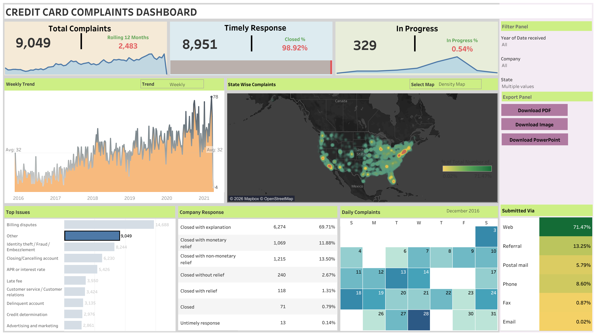

# 💳 Credit Card Complaints Analytics Dashboard

An interactive **Tableau dashboard** designed to analyze credit card consumer complaints across the United States. The dashboard provides a consolidated view of complaint volume, response performance, geographic distribution, major complaint categories, company responses, and submission channels.

🔗 **[View Interactive Dashboard on Tableau Public](https://public.tableau.com/views/CreditCardTableauDashboard/Dashboard1)**

---

## Dashboard Preview

---

## Project Overview

This project transforms credit card complaint data into an interactive business intelligence dashboard that makes it easier to monitor complaint patterns and response performance.

The dashboard allows users to explore:

- Overall complaint volume
- Rolling 12-month complaint activity
- Timely response and closure rates
- Complaints currently in progress
- Weekly complaint trends
- Geographic distribution across U.S. states
- Most common complaint issues
- Company response outcomes
- Complaint submission channels
- Daily complaint activity

---

## Key KPIs

The dashboard highlights several high-level performance indicators:

| KPI | Value |
|---|---:|
| Total Complaints | 86,893 |
| Rolling 12 Months | 20,202 |
| Timely Responses | 85,934 |
| Closed % | 98.90% |
| In Progress | 329 |
| In Progress % | 0.38% |

---

## Dashboard Features

### 📈 Complaint Trend Analysis
A dynamic time-series visualization tracks complaint activity over time and allows users to analyze changing complaint patterns.

### 🗺️ Geographic Analysis
An interactive U.S. map visualizes complaint concentration across states, helping identify geographic patterns in complaint activity.

### 🔍 Top Complaint Issues
Complaint categories are ranked by volume to highlight the most frequently reported consumer problems.

The leading categories shown in the dashboard include:

- Billing disputes
- Other
- Identity theft / Fraud / Embezzlement
- Closing/Cancelling account
- APR or interest rate
- Late fee
- Customer service / Customer relations

### 🏢 Company Response Analysis
The dashboard breaks down how complaints were resolved, including:

- Closed with explanation
- Closed with monetary relief
- Closed with non-monetary relief
- Closed without relief
- Closed with relief
- Closed
- Untimely response

### 📬 Submission Channel Analysis
Complaints can be compared across submission channels including:

- Web
- Referral
- Postal mail
- Phone
- Fax
- Email

### 📅 Daily Complaint View
A calendar-style visualization provides a day-level view of complaint activity for the selected period.

---

## Interactive Filters

Users can dynamically explore the dashboard using filters for:

- Year of Date Received
- Company
- State

The dashboard also includes controls for changing the trend view and geographic visualization.

---

## Tools & Technologies

- **Tableau Public** — dashboard development and interactive visualization
- **Microsoft Excel** — source dataset
- **Calculated Fields** — KPI and analytical calculations
- **Tableau Parameters** — dynamic visualization controls
- **Tableau Filters** — interactive data exploration
- **Geospatial Visualization** — state-level complaint analysis

---

## Key Insights

- **Billing disputes** represent the largest complaint category displayed in the dashboard, with **14,688 complaints**.
- **98.90%** of complaints are shown as closed.
- Only **0.38%** of complaints are currently in progress.
- **Web** is the dominant complaint submission channel, accounting for **68.92%** of submissions.
- **Closed with explanation** is the most common company response, representing **59.92%** of responses.
- Complaint volume varies considerably across states and over time, which can be explored interactively through the dashboard.

---

## Files

- `Credit Card Tableau Dashboard.twb` — Tableau workbook
- `data/Credit Card Dashboard.xlsx` — project dataset
- `images/dashboard.png` — dashboard preview

---

## Live Dashboard

Explore the complete interactive dashboard on Tableau Public:

### 👉 [Open Credit Card Complaints Dashboard](https://public.tableau.com/views/CreditCardTableauDashboard/Dashboard1)

---

## Author

**Taranveer Singh Gill**

Data Engineer | Data Analytics | Business Intelligence | Cloud Data Engineering

[LinkedIn](https://www.linkedin.com/in/taranveer-singh-gill-398b861a0/) • [GitHub](https://github.com/Taranveer-Singh-Gill)
